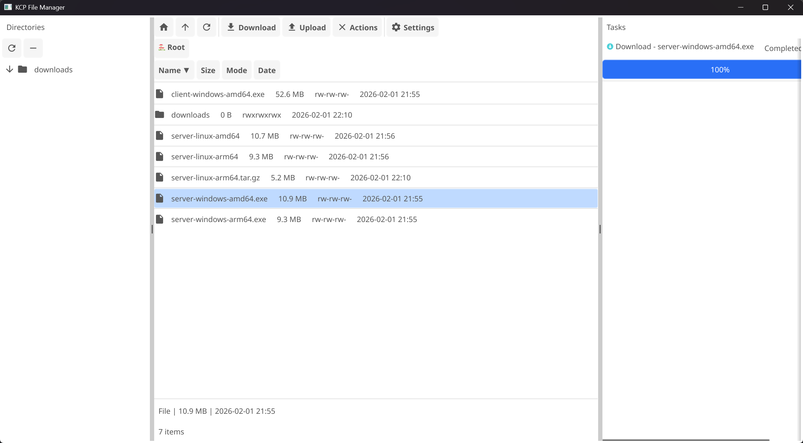

# Simple KCP File Manager

🚀 简单的基于 KCP 协议的文件管理器。

[](https://golang.org)
[](LICENSE)

## ✨ 特性

### 核心功能
- 📡 **KCP 协议**：基于 UDP 的可靠传输，比 TCP 更快，适合高延迟、高丢包网络
- 🔐 **AES-256 加密**：保护数据安全，PBKDF2 密钥派生
- ⚡ **多线程下载**：8 线程并行分块下载，充分利用带宽
- 📥 **断点续传**：支持暂停/恢复，意外中断后可继续下载
- ✅ **完整性校验**：SHA256 校验确保文件完整无损
- 📁 **双向传输**：上传/下载/文件夹操作

### GUI 界面（Fyne）
- 🌳 **目录树视图**：左侧目录树，支持懒加载和快速导航
- 📋 **文件列表**：名称、大小、权限、时间，支持排序
- 🧭 **面包屑导航**：可点击的路径导航，快速跳转
- 🖱️ **右键菜单**：完整的文件操作上下文菜单
- 📊 **任务队列**：实时进度显示，支持取消操作
- ✏️ **内置编辑器**：编辑 <1MB 的文本文件
- 📦 **压缩/解压**：ZIP/TAR 格式，服务端执行
- 📤 **打包传输**：自动压缩大文件和文件夹为 tar.gz，提升传输速度

### 安全性
- 🔑 **强制加密**：服务端必须通过 `-key` 参数指定密钥（无默认值）
- 🛡️ **路径安全**：防止目录遍历攻击
- 🔒 **密钥验证**：连接超时快速检测密钥错误

## 🏗️ 技术架构

```
┌─────────────────────────────────────────────────────────┐
│                    Application Layer                    │
│                  (File Manager / HTTP)                  │
├─────────────────────────────────────────────────────────┤
│                   smux (Multiplexing)                   │
│              (Stream Multiplexing Protocol)             │
├─────────────────────────────────────────────────────────┤
│              KCP (Reliable UDP Transport)               │
│              (Fast ARQ Protocol)                        │
├─────────────────────────────────────────────────────────┤
│                        UDP                              │
└─────────────────────────────────────────────────────────┘
```

**技术栈：**
- **传输层**：[KCP v5](https://github.com/xtaci/kcp-go) - 快速可靠的 ARQ 协议
- **多路复用**：[smux](https://github.com/xtaci/smux) - 在单个 KCP 连接上复用多个流
- **应用层**：HTTP 协议（GET/PUT/DELETE/POST）
- **GUI 框架**：[Fyne v2](https://fyne.io/) - Go 语言跨平台 GUI 库
- **加密**：AES-256-CBC，PBKDF2 密钥派生（4096 迭代）

### KCP 优化配置

采用类似 kcptun `fast3` 模式的激进配置：
- 窗口大小：1024
- NoDelay 模式：启用
- 间隔：10ms
- 重传：2 次
- NC：1（无拥塞控制）

## 📦 安装

### 预编译版本

前往 [Releases](../../releases) 页面下载对应平台的预编译二进制文件。

支持平台：
- Windows (amd64/arm64)
- Linux (amd64/arm64)
- macOS (amd64/arm64)

### 从源码编译

```bash
# 克隆仓库
git clone https://github.com/CertStone/simpleKcpFileManager.git
cd simpleKcpFileTransfer

# 安装依赖
go mod tidy

# 编译客户端
go build -o client/client ./client

# 编译服务端
go build -o server/server ./server
```

### 批量交叉编译

```bash
# Linux/macOS
./scripts/build.sh

# Windows PowerShell
.\scripts\build.ps1
```

## 🚀 使用方法

### 服务端

```bash
# 必须指定加密密钥（无默认值）
./server -key "your-secret-key"

# 指定共享目录和端口
./server -p 8080 -d /path/to/share -key "your-secret-key"

# 后台运行
nohup ./server -p 8080 -d /path/to/share -key "your-secret-key" > server.log 2>&1 &
```

**参数说明：**
- `-p`：监听端口（默认 8080）
- `-d`：共享目录（默认当前目录）
- `-key`：**加密密钥（必需）**

### 客户端

#### GUI 模式（推荐）

```bash
# 方式1：通过连接对话框
./client

# 方式2：命令行参数
./client -server 192.168.1.100:8080 -key "your-secret-key"
```

**GUI 功能：**
- 📂 浏览远程文件系统
- ⬇️ 下载文件/文件夹（支持断点续传）
- ⬆️ 上传本地文件
- 📝 重命名/删除文件
- 📁 创建新文件夹/文件
- 📦 压缩/解压缩（ZIP/TAR）
- ✏️ 编辑文本文件（<1MB）
- 🔍 排序和筛选
- ⚙️ **打包传输**：通过 Settings 按钮配置
  - 自动压缩文件夹和大文件（>10MB）为 tar.gz
  - 传输后自动解压，透明化处理
  - 显著提升小文件多场景的传输速度

**快捷操作：**
- 单击选择文件/文件夹
- 右键显示上下文菜单
- 拖拽支持（上传文件）
- 面包屑导航快速跳转

#### CLI 模式

```bash
# 下载单个文件
./client -cli -addr 192.168.1.100:8080 -url /video.mp4 -out ./downloads

# 下载文件夹
./client -cli -addr 192.168.1.100:8080 -url /folder -out ./downloads

# 指定并行数
./client -cli -addr 192.168.1.100:8080 -url /large.zip -workers 8

# 使用自定义密钥
./client -cli -addr 192.168.1.100:8080 -url /file.mp4 -key "your-secret-key"
```

**CLI 参数说明：**
- `-cli`：启用命令行模式
- `-addr`：服务器地址（默认 `127.0.0.1:8080`）
- `-url`：远程文件路径
- `-out`：保存目录（默认 `./download`）
- `-workers`：并行下载线程数（默认 8）
- `-key`：加密密钥（与服务端一致）

## 📸 界面预览

### 主窗口布局



**工具栏按钮：**
- 🏠 Home - 返回根目录
- ⬆ Up - 上一级目录
- 🔄 Refresh - 刷新文件列表
- ⬇ Download - 下载选中文件
- ⬆ Upload - 上传本地文件
- ☰ Actions - 更多操作（右键菜单）
- ⚙ **Settings** - 打包传输设置

**功能说明：**
- **左侧**：目录树（懒加载、展开/折叠）
- **中间**：文件列表（名称、大小、权限、时间、排序）
- **右侧**：任务队列（进度条、取消按钮）
- **顶部**：面包屑导航（可点击跳转）+ 工具栏
- **右键**：上下文菜单（下载、上传、删除、重命名等）

## ⚙️ 配置

### 性能调优

#### 打包传输设置

通过 GUI 工具栏的 **Settings** 按钮，可以配置打包传输功能：

**功能说明：**
- **启用条件**：
  - 文件夹：始终启用压缩传输
  - 单个文件：大于指定阈值时启用压缩（默认 10MB）
- **压缩格式**：tar.gz（使用 gzip 压缩）
- **自动处理**：
  - 上传：客户端压缩 → 传输 → 服务端自动解压
  - 下载：服务端压缩 → 传输 → 客户端自动解压
- **适用场景**：
  - 小文件较多的文件夹（源代码、文档等）
  - 大文件传输（视频、安装包等）
  - 高延迟网络环境

**使用建议：**
- ✅ 推荐：代码仓库、文档文件夹、配置文件目录
- ✅ 推荐：大于 10MB 的单个文件
- ⚠️ 不推荐：已压缩的文件（mp4、zip、rar 等）
- ⚠️ 不推荐：快速网络下的少量文件

#### 客户端参数(需要重新编译)

客户端可调整参数（`client/gui/main.go` 和 `kcpclient/client.go`）：

```go
const (
    defaultWorkers   = 8                   // 并行下载线程数
    defaultChunkSize  = 4 * 1024 * 1024    // 每个分块大小 (4MB)
    maxParallelTasks = 3                    // 最大同时下载任务数
    connectionTimeout = 3 * time.Second     // 连接超时（密钥验证）
)
```

**服务端配置**（`server/main.go`）：
- 监听端口：默认 8080
- 共享目录：通过 `-d` 参数指定
- 最大连接数：无限制
- 并发上传：支持（带文件锁保护）

## 🔧 开发

详细的开发人员文档请参阅 **[docs/DEVELOPMENT.md](docs/DEVELOPMENT.md)**，包含：

- 📐 **架构设计**：系统架构图、协议栈、模块职责
- 🔌 **API 参考**：完整的 HTTP 端点文档
- 💡 **技术要点**：HTTP-over-KCP、打包传输、多线程下载、Fyne 事件处理
- 🛠️ **开发指南**：添加新功能、调试技巧
- ⚡ **性能调优**：KCP 参数、并发配置

### 依赖项

- [fyne.io/fyne/v2](https://github.com/fyne-io/fyne) ^2.7.0 - 跨平台 GUI
- [github.com/xtaci/kcp-go/v5](https://github.com/xtaci/kcp-go) ^5.6.1 - KCP 实现
- [github.com/xtaci/smux](https://github.com/xtaci/smux) ^1.0.0-rc - 流多路复用
- [golang.org/x/crypto](https://golang.org/x/crypto) - 加密库

## 🐛 故障排除

### 连接失败

**问题**：无法连接到服务器
```
Connection failed - address 127.0.0.1: missing port in address
```

**解决方案**：
1. 确保地址包含端口号：`127.0.0.1:8080`
2. 如果只输入 `127.0.0.1`，系统会自动添加 `:8080`
3. 检查服务端是否正在运行

**问题**：连接超时（密钥错误）
```
Connection timeout (server unreachable or wrong key)
```

**解决方案**：
1. 确认服务端和客户端使用相同的密钥
2. 服务端查看启动命令中的 `-key` 参数
3. 客户端在连接对话框或 `-key` 参数中输入相同密钥
4. 超时设置为 3 秒，用于快速检测密钥错误

### 下载问题

**问题**：下载卡住或速度慢

**解决方案**：
1. 检查网络延迟和丢包率
2. 调整并行线程数（`-workers` 参数）
3. 检查服务端磁盘 I/O
4. 查看任务队列中的实时进度

**问题**：断点续传不工作

**解决方案**：
1. 检查本地文件是否部分下载
2. 查看日志：`[DEBUG] DownloadFile: startByte=xxx`
3. 手动删除部分下载的文件重新下载
4. 检查 SHA256 校验和是否匹配

### UI 问题

**问题**：界面冻结或无响应

**解决方案**：
1. 查看控制台日志中的 Fyne 线程错误
2. 确保所有 UI 更新在 `fyne.Do()` 中
3. 重启客户端

**问题**：目录树不加载

**解决方案**：
1. 点击刷新按钮（🔄 图标）
2. 检查连接状态
3. 展开节点时会自动加载子目录

## 📄 License

MIT License

## 🙏 致谢

- [xtaci/kcp-go](https://github.com/xtaci/kcp-go) - 优秀的 KCP Go 实现
- [xtaci/kcptun](https://github.com/xtaci/kcptun) - KCP 隧道，本项目参考了其配置
- [fyne-io/fyne](https://github.com/fyne-io/fyne) - 简洁优雅的 Go GUI 框架
- [Claude Opus 4.5](https://claude.ai/claude) - AI 代码生成与优化

